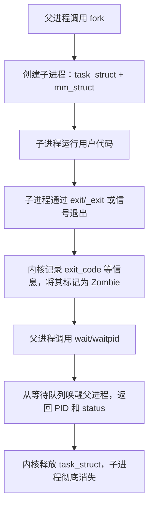

<div align=center></div>

<div align=left><font face="华文楷体" size=4 color=#0000ff><b>🎉博主首页：</b></font>
<a href="https://blog.csdn.net/m0_68617301?spm=1010.2135.3001.5343"><font color=#9AC0CD><b>有趣的中国人</b></font></a>
<br /><br />

<div align=left><font face="华文楷体" size=4 color=#0000ff><b>🎉专栏首页：</b></font>
<a href="https://blog.csdn.net/m0_68617301/category_12652366.html"><font color=#9AC0CD><b>操作系统原理</b></font></a>
<br /><br />

<div align=left><font face="华文楷体" size=4 color=#0000ff><b>🎉其它专栏：</b></font>
<a href="https://blog.csdn.net/m0_68617301/category_12602970.html?spm=1001.2014.3001.5482"><font color=#9AC0CD><b>C++初阶 |</b></font></a>
<a href="https://blog.csdn.net/m0_68617301/category_12647125.html?spm=1001.2014.3001.5482"><font color=#9AC0CD><b> C++进阶 |</b></font></a>
<a href="https://blog.csdn.net/m0_68617301/category_12594242.html?spm=1001.2014.3001.5482"><font color=#9AC0CD><b> 初阶数据结构</b></font></a>

<p align="center">
  
</p>

> <font color=black><b>这一篇是整理的 “Linux 进程控制” 笔记，围绕三件事展开：</b></font>  
> <font color=#4169E1><b>进程是谁、进程怎么结束、父进程如何等待子进程。</b></font>  
> <font color=black><b>把 task_struct / mm_struct / fork / exit / _exit / wait / waitpid / 僵尸进程 串在一条线上。</b></font>  

@[toc]

---

# 1. 内核眼里的进程：task_struct + mm_struct + 代码数据

从用户角度看，进程就是“一个正在运行的程序”；  
从内核角度看，进程主要由三部分组成：

1. **代码和数据**  
   - 来自 ELF 可执行文件：`.text`、`.data`、`.bss` 等段；  
   - 被加载到进程的虚拟地址空间（前面已经画过地址空间结构）。

2. **task_struct（进程控制块 PCB）**  
   - 记录 PID、父子关系、调度信息（优先级、时间片）、信号、打开的文件等；  
   - 还包含 `exit_code` 等字段，用来在进程退出时保存退出信息。

3. **mm_struct + 页表**  
   - `mm_struct` 描述整个虚拟地址空间的范围、各段的起始结束地址；  
   - 通过 VMA 管理每一个虚拟内存区域；  
   - 页表负责把虚拟地址翻译为物理地址。

可以把 “一个进程” 粗暴地写成：

```text
进程 ≈ { task_struct, mm_struct, 一套地址空间映射, 它的代码和数据}
```

---

# 2. fork：一行代码创造两个进程

典型用法：

```c
pid_t pid = fork();
```

fork 之后：

- 在 **父进程** 中：`pid` > 0，为新建子进程的 PID；  
- 在 **子进程** 中：`pid` == 0。

fork 做的事情重点有两块：

1. **复制进程相关的数据结构**  
   - 为子进程新建一个 `task_struct`，里边的父 PID 指向原进程；  
   - 为子进程建立自己的 `mm_struct` 和页表，但物理页通过 COW 机制共享。

2. **把子进程插入调度队列**  
   - 等待调度器选择它运行；  
   - 此时父子进程的代码几乎一样，只是 `fork` 的返回值不同。

---

# 3. 进程终止：从 “活着” 到 “僵尸” 再到 “完全消失”

## 3.1 从创建到终止的大致过程

- 创建进程：  
  1. 内核创建和初始化 `task_struct` 等 DS；  
  2. 加载/映射代码和数据到虚拟地址空间；  
  3. 把进程加入就绪队列，开始运行。

- 终止进程：  
  1. 不再参与调度，状态从 RUNNING/RUNNABLE 变为 EXIT_ZOMBIE 等；  
  2. 释放对应地址空间中的物理页和大部分资源；  
  3. `task_struct` 暂时保留，等待父进程来“领取退出信息”。

**只有当父进程通过 `wait`/`waitpid` 读取了退出状态后，内核才会真正把 `task_struct` 释放掉。**

---

## 3.2 进程终止的几种方式

1. **程序正常跑完**

   - `main` 正常走到末尾，执行 `return code;`；  
   - C 运行时库把 `code` 传给 `exit(code)`，再交给内核。

2. **显式调用 `exit()`**

   ```c
   exit(0);      // 显式定义退出码
   ```

   - `exit` 是库函数，负责做“用户态收尾工作”；  
   - 真正让进程消失的是最后的系统调用（`_exit` 或 `exit_group`）。

3. **异常退出 / 被信号杀死**

   - 比如除零、非法内存访问导致段错误（SIGSEGV）、收到 SIGKILL；  
   - 内核会在 `task_struct` 中记录：进程是被哪个信号终止的。

无论哪种情况，**内核最终都会填好 `exit_code` 等字段，留待父进程查询。**

---

## 3.3 exit vs _exit：库函数和系统调用的边界

在用户态可以看到两个接口：

```c
void exit(int status);   // C 库提供
void _exit(int status);  // 系统调用的封装
```

二者区别：

- `exit`：  
  - 调用所有通过 `atexit()` 注册的回调函数；  
  - 刷新 stdio 缓冲区（`printf` 的内容真的写出去）；  
  - 关闭标准 I/O 流；  
  - 最后陷入内核，调用 `_exit` 或 `exit_group`。

- `_exit`：  
  - 不做用户态清理；  
  - 直接系统调用，让内核回收本进程空间。

在子进程中经常会看到：

```c
if (pid == 0) {
    // child
    // ... 一些操作 ...
    _exit(0);
}
```

避免子进程重复执行 `atexit` 回调或重复冲刷父进程复制来的 stdio 缓冲区。

---

# 4. 僵尸进程（Zombie）：退出了但还没被“收尸”

子进程退出后，如果父进程 **一直没有调用 `wait`/`waitpid`**：

- 内核不能马上释放 `task_struct`，要留着 PID、退出码、信号等信息；  
- 这个只剩一点信息的 PCB 状态就被标记为 **僵尸进程**。

特点：

- 不占用 CPU；  
- 地址空间已释放，不再使用大量内存；  
- 但占用 PID 号和一小块内核内存。

避免僵尸进程的本质就是：**父进程要主动去等待并回收子进程。**

---

# 5. 进程等待：wait / waitpid

## 5.1 等待的目的

父进程等待子进程主要是为了两件事：

1. 获得子进程的退出信息（退出码，是否被信号终止等）；  
2. 通知内核可以释放子进程的 `task_struct`，彻底回收资源。

否则就会留下僵尸。

---

## 5.2 wait：等待任意一个子进程退出

原型（简化）：

```c
pid_t wait(int *status);
```

行为过程：

1. 如果已经有退出但还没被等待的子进程：  
   - 立刻返回其中一个子进程的 PID；  
   - 把对应的退出信息写入 `*status`；  
   - 同时内核把该子进程的 `task_struct` 释放掉。

2. 如果当前还没有子进程退出：  
   - 把父进程挂到一个等待队列上；  
   - 调用 `schedule()` 让出 CPU，父进程进入睡眠态；  
   - 一旦有子进程退出，内核会把父进程从等待队列唤醒，`wait` 返回。

可以理解为：**`wait` 阻塞父进程，直到有一个子进程退出为止。**

---

## 5.3 waitpid：精细控制等待哪个子进程、如何等待

原型（简化）：

```c
pid_t waitpid(pid_t pid, int *status, int options);
```

- `pid`：  
  - `> 0`：等待指定 PID 的子进程；  
  - `-1`：等待任意一个子进程，相当于 `wait`。

- `status`：输出参数，用来存储退出状态。  
- `options`：控制等待行为，常用的有 `0` 和 `WNOHANG`。

### 常用状态宏

```c
if (WIFEXITED(status)) {
    int code = WEXITSTATUS(status);   // 正常退出时的退出码
}
if (WIFSIGNALED(status)) {
    int sig = WTERMSIG(status);       // 被哪个信号终止
}
```

含义：

- `WIFEXITED(status)`：返回非 0 表示子进程是“正常退出”的；  
- `WEXITSTATUS(status)`：返回 `exit(code)` 或 `return code` 中的 `code`；  
- `WIFSIGNALED(status)`：表示子进程是被信号终止的。

---

## 5.4 阻塞等待 vs 非阻塞等待（WNOHANG）

- `options = 0`：**阻塞等待**  
  - 如果没有子进程退出，父进程睡眠在等待队列；  
  - 等到有子进程退出时被唤醒，`waitpid` 返回该子进程 PID。

- `options = WNOHANG`：**非阻塞等待**  
  - 如果目前没有子进程退出，立即返回 0；  
  - 父进程可以在循环中写自己的逻辑，顺便偶尔调用 `waitpid` 收尸。

典型代码骨架：

```c
pid_t pid;
int status;

while ((pid = waitpid(-1, &status, WNOHANG)) > 0) {
    if (WIFEXITED(status)) {
        printf("child %d exit, code = %d\n", pid, WEXITSTATUS(status));
    } else if (WIFSIGNALED(status)) {
        printf("child %d killed by signal %d\n", pid, WTERMSIG(status));
    }
}
// pid == 0：当前没有子进程退出
// pid < 0：出错，比如没有子进程
```

---

# 6. 一张图串起来：fork、exit、wait 的完整闭环



整个过程对应到三个关键词：

- **控制**：用 `fork`、`exec`、`exit/_exit` 控制进程的创建与销毁；  
- **通信**：用信号、退出码、`status` 宏在父子之间传递状态；  
- **回收**：用 `wait`/`waitpid` 清理资源，避免僵尸进程堆积。

