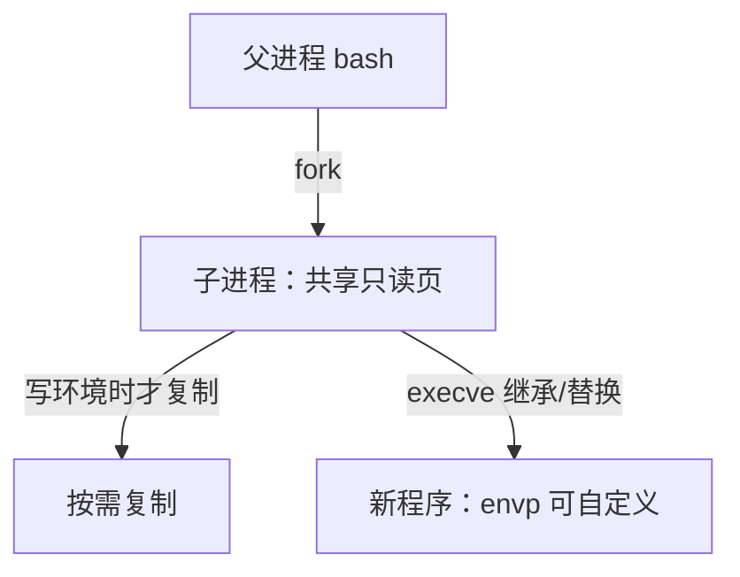
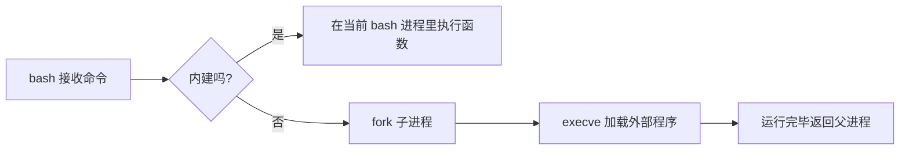

<div align=center></div>

<div align=left><font face="华文楷体" size=4 color=#0000ff><b>🎉博主首页：</b></font>
<a href="https://blog.csdn.net/m0_68617301?spm=1010.2135.3001.5343"><font color=#9AC0CD><b>有趣的中国人</b></font></a>
<br /><br />

<div align=left><font face="华文楷体" size=4 color=#0000ff><b>🎉专栏首页：</b></font>
<a href="https://blog.csdn.net/m0_68617301/category_12863943.html"><font color=#9AC0CD><b>操作系统原理</b></font></a>
<br /><br />

<div align=left><font face="华文楷体" size=4 color=#0000ff><b>🎉其它专栏：</b></font>
<a href="https://blog.csdn.net/m0_68617301/category_12602970.html?spm=1001.2014.3001.5482"><font color=#9AC0CD><b>C++初阶 |</b></font></a>
<a href="https://blog.csdn.net/m0_68617301/category_12647125.html?spm=1001.2014.3001.5482"><font color=#9AC0CD><b> C++进阶 |</b></font></a>
<a href="https://blog.csdn.net/m0_68617301/category_12594242.html?spm=1001.2014.3001.5482"><font color=#9AC0CD><b> 初阶数据结构</b></font></a>

<p align="center">
  
</p>

> <font color=black>**亲爱的小伙伴们，大家好！这篇文章我们把握 Linux 中三块“高频且基础”的知识：**</font>
> <font color=#4169E1>**进程优先级**</font>、<font color=#4169E1>**命令行参数（argc/argv）**</font>、<font color=#4169E1>**环境变量**</font>。  
> <font color=black><b>它们决定了一个程序“如何被启动、如何被调度、在什么环境里运行”。</b></font>  
> <font color=black><b>如果本文对你有启发，请点赞 👍、收藏 🌟、留言 📝 支持！</b></font>

@[toc]
---

# 1. 进程优先级（Priority）
<br />

## 1.1 本质与作用
- 在 Linux 中，每个进程对应一个 `task_struct`，其中保存**调度相关字段**（优先级、时间片等）。
- **优先级越高，越容易获得 CPU 时间片**；优先级越低，等待时间更长。

## 1.2 为什么要有优先级
- CPU/内存/IO 等资源有限；任务数量多且类型不同（前台交互、后台服务、内核线程等）。
- 通过优先级实现 **公平 + 效率** 的折中：关键任务优先，低优先级任务让步。

## 1.3 术语对照
| 名称 | 说明 |
|---|---|
| `NI`（nice 值） | 用户可调节的“偏移量” |
| `PRI`（动态优先级） | 调度器综合计算出的优先级 |
| 记忆口诀 | **nice 越小越“凶”，优先级越高** |

- nice 值范围：`[-20, +19]`
  - `-20` → 最高优先级
  - `+19` → 最低优先级
- **普通用户**：只能调低自身优先级（增大 nice 值）  
- **root**：可以把进程优先级调高（减小 nice 值）

## 1.4 常用命令
```bash
ps -al                 # 查看 PRI/NI 等字段
top                    # 实时查看；在 top 界面按 r 修改某 PID 的 nice
renice -n 5 PID        # 修改已存在进程的 nice 值
sudo nice -n -5 ./a.out  # 更高优先级启动新程序（需 root）
```

## 1.5 调度循环（示意）


---

# 2. 命令行参数（argc / argv）
<br />

## 2.1 main 的入口
```cpp
int main(int argc, char *argv[])
```
- `argc`：参数个数  
- `argv[]`：参数数组（`argv[0]` 通常是程序名）

## 2.2 参数从哪里来（调用链）
1. 用户在 **bash** 输入命令；  
2. bash 解析字符串并构建 `argv[]`；  
3. `fork()` 创建子进程；  
4. 子进程调用 `execve(path, argv, envp)`；  
5. **内核**加载可执行文件，新程序从 `main(argc, argv, envp)` 开始执行。

```mermaid
graph LR
A[bash 读取命令行] --> B[argv[]]
B --> C[fork 子进程]
C --> D[execve(path, argv, envp)]
D --> E[内核加载映像 → main()]
```

## 2.3 演示代码
```cpp
#include <stdio.h>
int main(int argc, char *argv[]) {
    for (int i = 0; i < argc; i++) {
        printf("argv[%d] = %s\\n", i, argv[i]);
    }
    return 0;
}
```

**示例**
```bash
$ ./a.out linux kernel study
argv[0] = ./a.out
argv[1] = linux
argv[2] = kernel
argv[3] = study
```

---

# 3. 环境变量（Environment Variables）
<br />

## 3.1 概念速记
- 环境变量是进程的**运行时配置表**（键值对）。  
- 每个进程都有自己的副本，默认从**父进程继承**。

## 3.2 常见环境变量
| 变量名 | 说明 |
| --- | --- |
| `PATH` | 查找可执行文件的目录列表 |
| `HOME` | 用户主目录 |
| `PWD`  | 当前工作目录 |
| `SHELL` | 当前使用的 Shell 程序 |
| `HISTSIZE` | bash 历史条数 |

## 3.3 `PATH` 的搜索与修改
- 执行命令时，bash 会按 `PATH` 中的目录顺序搜索可执行文件。  
- **临时修改**（仅当前终端有效）：
```bash
export PATH="$PATH:/usr/local/mybin"
```
- **永久生效**（下次终端也有效）：把上面这行写入 `~/.bashrc`（或登录 Shell 的 `~/.bash_profile`），然后：
```bash
source ~/.bashrc
```

## 3.4 继承与写时拷贝（COW）
- `fork()` 后，子进程**继承父进程的环境变量副本**（COW：按需复制）。  
- `execve()` 执行新程序时，默认沿用当前环境（也可以传入自定义 `envp`）。



## 3.5 C 接口常用法
```c
#include <stdio.h>
#include <stdlib.h>

int main() {
    printf("HOME = %s\\n", getenv("HOME"));
    setenv("TEST_VAR", "hello", 1); // 覆盖
    printf("TEST_VAR = %s\\n", getenv("TEST_VAR"));
    return 0;
}
```

**一次性打印全部环境变量**
```c
#include <stdio.h>
extern char **environ;
int main() {
    for (int i = 0; environ[i]; ++i) puts(environ[i]);
    return 0;
}
```

---

# 4. 内建命令 vs 外部命令
<br />

## 4.1 区别一览
| 类型 | 典型示例 | 是否创建子进程 | 为什么 |
| --- | --- | --- | --- |
| **内建命令** | `cd`、`export`、`alias`、`echo`（也可能有外部版） | 否 | 在 bash 进程内直接执行，能修改当前 Shell 状态（例如 `cd` 改变目录） |
| **外部命令** | `/usr/bin/echo`、`/usr/bin/pwd` | 是 | 通过 `fork` + `exec` 启动新程序 |

> 关键点：如果 `cd` 作为外部程序运行，就**无法改变当前终端的工作目录**，所以它必须是内建。

## 4.2 如何辨别
```bash
type -a cd
type -a echo
type -a pwd
```
- 显示 `is a shell builtin` → 内建；  
- 显示路径如 `/usr/bin/echo` → 外部程序（有些命令内建与外部版本并存）。

## 4.3 简化执行流程


---

# 5. 实验清单（可直接跑）
<br />

## 5.1 查看进程优先级
```bash
ps -al | head
top                  # 在 top 界面按 r 可修改某个进程的 nice
```

## 5.2 PATH 与永久生效
```bash
echo "$PATH"
export PATH="$PATH:$HOME/bin"   # 临时
echo 'export PATH="$PATH:$HOME/bin"' >> ~/.bashrc
source ~/.bashrc                # 让当前会话立即生效
```

## 5.3 区分内建与外部
```bash
type -a echo
type -a pwd
type -a cd
```

## 5.4 程序中打印 `argv` 与 `environ`
```c
#include <stdio.h>
extern char **environ;
int main(int argc, char *argv[]) {
    puts("[argv]");
    for (int i = 0; i < argc; ++i) printf("argv[%d]=%s\\n", i, argv[i]);
    puts("[environ]");
    for (int i = 0; environ[i]; ++i) puts(environ[i]);
    return 0;
}
```

---

# 6. 常见疑问速记（结合你之前的问题）
<br />

- **Q：为什么我不显式给子进程传环境变量，子进程也有？**  
  A：`fork` 会继承父进程的环境（COW），`execvp` 默认沿用当前进程的环境，所以能看到与 bash 相同的变量。

- **Q：修改 `PATH` 后，新开终端又恢复？**  
  A：你只在当前 Shell 做了临时修改。写入 `~/.bashrc`（或登录 Shell 的 `~/.bash_profile`）并 `source` 才会对新会话生效。

- **Q：为什么 `echo/pwd` 既是内建又存在 `/usr/bin/echo`？**  
  A：为了兼容不同 Shell、脚本或最小化环境。`type -a echo` 可以查看优先级顺序；通常优先使用内建版本。

- **Q：`cd` 参数是否合法怎么判断？**  
  A：在 C 程序中检查 `chdir(path)` 返回值是否为 `-1`；在 Shell 里可用 `[[ -d "$1" ]]` 判断目录是否存在。

- **Q：普通用户能把进程优先级调高吗？**  
  A：不能。普通用户只能**降低**自身优先级（增大 nice 值）；**提升**优先级需要 `root`。

---

# 7. 小结
<br />

- **优先级（PRI + nice）** 决定进程拿到 CPU 的速度与频率；  
- **命令行参数（argc/argv）** 由 bash 解析并通过 `execve` 传给 `main`；  
- **环境变量** 通过 `fork` 继承，`execve` 继续使用或替换；  
- **内建命令** 在 bash 内执行以便修改当前会话状态，外部命令则走 `fork+exec`。

> 把这四块打通，你就掌握了“一个命令如何被解析、加载与调度”的全流程。欢迎在评论区补充你的实验结果或遇到的问题！
