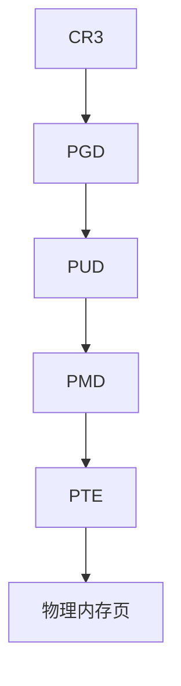
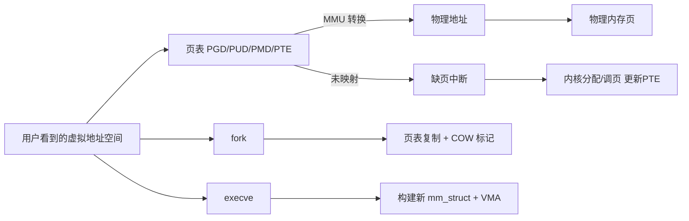

<div align=center></div>

<div align=left><font face="华文楷体" size=4 color=#0000ff><b>🎉博主首页：</b></font>
<a href="https://blog.csdn.net/m0_68617301?spm=1010.2135.3001.5343"><font color=#9AC0CD><b>有趣的中国人</b></font></a>
<br /><br />

<div align=left><font face="华文楷体" size=4 color=#0000ff><b>🎉专栏首页：</b></font>
<a href="https://blog.csdn.net/m0_68617301/category_12863943.html"><font color=#9AC0CD><b>操作系统原理</b></font></a>
<br /><br />

<div align=left><font face="华文楷体" size=4 color=#0000ff><b>🎉其它专栏：</b></font>
<a href="https://blog.csdn.net/m0_68617301/category_12602970.html?spm=1001.2014.3001.5482"><font color=#9AC0CD><b>C++初阶 |</b></font></a>
<a href="https://blog.csdn.net/m0_68617301/category_12647125.html?spm=1001.2014.3001.5482"><font color=#9AC0CD><b> C++进阶 |</b></font></a>
<a href="https://blog.csdn.net/m0_68617301/category_12594242.html?spm=1001.2014.3001.5482"><font color=#9AC0CD><b> 初阶数据结构</b></font></a>

<p align="center">
  
</p>

> <font color=black>**亲爱的小伙伴们，这篇文章我们把你昨天手写的三页 OS 笔记整理成一次性吃透的超清版本！**</font>  
> <font color=#4169E1>**进程地址空间、虚拟地址、物理地址、页表、多级页表、CR3、缺页中断、COW、mm_struct、VMA**</font> 一篇打尽。  
> <font color=black><b>内容极其硬核，但讲得尽量通俗。看完你会比 90% 的计算机学生更懂。</b></font>  
> <font color=black><b>如果觉得有帮助，记得点赞 👍、收藏 🌟、留言 📝 支持一下！</b></font>

@[toc]

---

# 1. 进程地址空间是什么？

进程运行时，CPU **不会直接使用物理地址**，而是看到一个独立的 **虚拟地址空间（VAS）**。

下图是典型 Linux 32/64 位程序的内存布局：

```text
高地址
+---------------------------+
|         stack（栈）        |
|     局部变量、返回地址     |
+---------------------------+
|    共享库 / mmap 映射区     |
+---------------------------+
|         heap（堆）         |
|     malloc/new 分配区域     |
+---------------------------+
|     .bss（未初始化数据）    |
+---------------------------+
|     .data（已初始化数据）   |
+---------------------------+
|     .text（代码段，可执行）  |
+---------------------------+
低地址
```

📌 特点：

- 每个进程看到的地址空间都是“独一份”的  
- 并不是所有虚拟地址背后都有物理内存  
- 真正的物理内存由 **页表** 决定是否映射  

---

# 2. 虚拟地址 → 物理地址：MMU + 页表

CPU 执行指令，如：

```c
int x = *p;
```

其中 `p` 是一个虚拟地址（VA）。地址转换流程如下：


## 2.1 页表条目的内容（PTE）

PTE（Page Table Entry）包含：

| 字段 | 含义 |
|------|------|
| PFN | 物理页帧号 |
| P | Present 位（是否已映射） |
| R/W | 可读写 |
| U/S | 用户态是否可访问 |
| NX | 是否可执行 |
| A/D | 访问/脏位 |
| COW | 写时复制标记 |

访问非法则触发 **段错误（segfault）**。

---

# 3. 多级页表（x86-64 的四级页表）

Linux x86-64 使用四级页表：

```
CR3 → PGD → PUD → PMD → PTE → 物理页
```

结构示意：



优势：

- VA 空间巨大（128TB），但用多级结构节省内存
- 未使用的区域不需要分配中间页表

---

# 4. 缺页中断：物理页不是一开始就分配

访问未映射的虚拟地址会触发：

```
Page Fault → 调用 do_page_fault → 内核判断是否合法
```

若合法，OS 会：

1. 分配一页物理内存（或从文件加载）
2. 更新页表 PTE（Present=1）
3. 重新执行指令

这叫 **按需调页（Demand Paging）**。

---

# 5. fork()：页表复制 + COW 写时复制

你手写笔记的重点：**父子进程共享物理页，写时复制**。

初始状态（fork 刚结束）：

```text
父页表 ---+
          \
           \（共享物理页）
          /
子页表 ---+
```

所有页都被标记为 **只读 + COW**。

### 当某一方修改这页：

1. 触发写保护异常
2. OS 分配新物理页
3. 将旧页内容复制过去
4. 当前进程更新 PTE 指向新的物理页
5. 取消 COW 标记

最终变成：

```
父进程 → 物理页A
子进程 → 物理页B（新复制）
```

---

# 6. execve()：加载 ELF，建立全新地址空间

execve 会：

- 丢弃旧的地址空间（mm_struct）
- 根据 ELF 的 Program Header 创建新的 VMA
- 重建堆、栈、.text、.data、.bss 等区域
- 设置初始寄存器（如 RIP = _start）

---

# 7. mm_struct & VMA：虚拟内存的核心结构

Linux 使用以下结构管理进程的地址空间：

## 7.1 mm_struct（进程的“内存总表”）

```c
struct mm_struct {
    struct vm_area_struct *mmap; // VMA 链表/红黑树
    pgd_t *pgd;                  // 页表基地址
    unsigned long start_code, end_code;
    unsigned long start_data, end_data;
    unsigned long start_brk, brk;
    unsigned long start_stack;
};
```

## 7.2 VMA（虚拟内存区域）

每段连续内存对应一个 VMA，例如：

- text
- data/bss
- heap
- stack
- mmap 文件映射

```c
struct vm_area_struct {
    unsigned long vm_start, vm_end;
    unsigned long vm_flags;
    struct file *vm_file;
    struct vm_area_struct *vm_next;
    struct rb_node vm_rb;
};
```

---

# 8. CR3：页表切换的关键

进程切换时，内核会：

```
CR3 ← next->mm->pgd
```

MMU 立刻开始使用新的页表，于是：

> **CPU 进入了另一个进程的“世界”。**

---

# 9. 虚拟地址从哪里来？（编译 → 链接 → 加载）

### 1）编译 `.c → .o`
- 地址大多是段内偏移（相对地址）

### 2）链接 `.o → ELF`
- 链接器决定 text/data/bss 的虚拟地址布局
- 写入 ELF Program Header

### 3）加载 `execve`
- 内核根据 ELF 创建 VMA
- 映射物理页（按需加载）

总结一句：

> 虚拟地址是“链接器决定的逻辑地址”，由“内核 + 页表”让它变成真正能用的地址。

---

# 10. 没有虚拟地址会怎样？

- 进程之间的内存不隔离  
- 任何程序都可能写到别人的代码或数据  
- 无法实现共享库、mmap、COW、多线程堆栈  
- 安全性几乎为零

所以现代 OS 必然使用：

> **虚拟地址 + 页表 + MMU**

---

# 11. 一张总图总结全篇



---

# 12. 小结（超高频面试考点）

✔ 进程地址空间包含 text/data/bss/heap/stack/mmap  
✔ 页表负责虚拟地址 → 物理地址映射  
✔ 缺页中断 + 按需调页节省内存  
✔ fork = 页表复制 + COW  
✔ exec = 重建地址空间  
✔ mm_struct 管整个虚拟内存  
✔ VMA 管每一段区间  
✔ CR3 决定当前使用哪张页表  

> 看完这一篇，你对操作系统“虚拟内存”部分的理解已经远超大多数同专业学生了。

---

如果你要我继续写下一篇（例如 mmap、共享库、ELF 解析、栈溢出原理、缓存行等），直接告诉我主题即可！
